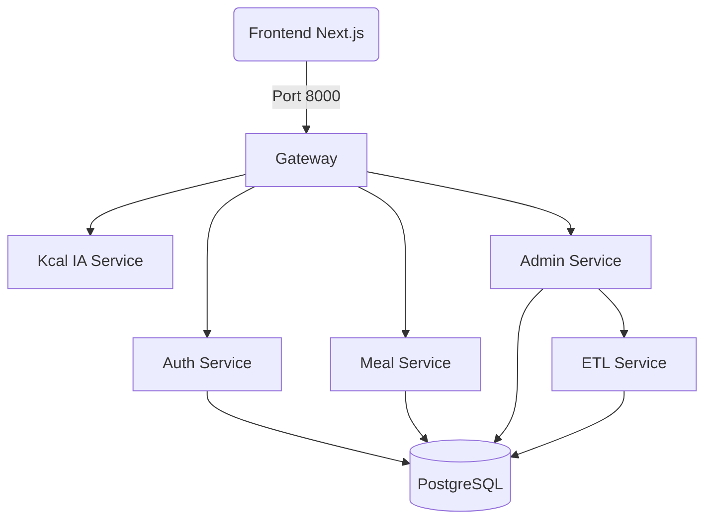

# 🥗 JARMY Backend - Écosystème Microservices

Bienvenue dans le backend de **JARMY**, l'application intelligente de suivi nutritionnel et sportif. Cette plateforme repose sur une architecture microservices modulaire, performante et scalable, utilisant **FastAPI** pour les APIs et **PostgreSQL** pour la persistance des données.

---

## 🏗️ Architecture du Système

Le backend est orchestré via Docker et se compose de 7 conteneurs principaux :

### 1. 🛡️ [Auth Service](./services/auth) (Port 8004)
Cœur de la sécurité. Gère les comptes utilisateurs, le login classique et le SSO Google.
- **Technologies** : FastAPI, Google Auth Library, SQLAlchemy.
- **Responsabilité** : Profils utilisateurs, objectifs caloriques, abonnements.

### 2. 🍽️ [Meal Service](./services/meal) (Port 8003)
Gestion de la donnée métier "Nutrition".
- **Technologies** : FastAPI, SQL (Raw & Mappings).
- **Responsabilité** : Catalogue d'aliments (10k+ entrées), journal alimentaire, lignes de repas.

### 3. 🧠 [Kcal IA Service](./services/kcal) (Port 8001)
Le "cerveau" NLP de l'application.
- **Technologies** : FastAPI, SpaCy (Modèle NER entraîné).
- **Responsabilité** : Extraction d'aliments et quantités depuis un texte libre (ex: "200g de poulet et 1 banane").

### 4. ⚡ [Gateway Service](./services/gateway) (Port 8000)
Le point d'entrée unique (API Gateway).
- **Technologies** : FastAPI, HTTPX.
- **Responsabilité** : Routage unifié, agrégation de services, gestion globale des CORS.

### 5. 📊 [Admin Service](./services/admin) (Port 8006)
Outil d'administration et de qualité de donnée.
- **Technologies** : FastAPI, Analytics SQL.
- **Responsabilité** : Dashboard direction, contrôle qualité (anomalies), exports de données, monitoring ETL.

### 6. 🔄 [ETL Service](./services/etl) (Port 8002)
Pipeline d'intégration de données.
- **Technologies** : Python, APScheduler.
- **Responsabilité** : Importation et nettoyage des datasets Kaggle (Nutrition & Gym) vers PostgreSQL.

### 7. 🗄️ Base de Données & Outils
- **PostgreSQL 16** (Port 5432) : Base de données relationnelle centrale.
- **Adminer** (Port 8080) : Interface graphique de gestion SQL.

---

## 🚀 Installation et Lancement

### Pré-requis
- Docker & Docker Compose
- Un fichier `.env` à la racine de `services/auth` pour les clés Google (Optionnel)

### Démarrage
```bash
# Se placer dans le dossier Back
cd JARMY/Back

# Lancer tous les services
docker-compose up --build -d
```

### Initialisation de la donnée
Le pipeline ETL est configuré pour se lancer automatiquement, mais vous pouvez le déclencher manuellement via l'Admin UI pour peupler la base avec les datasets sportifs et nutritionnels.

---

## 🚦 Schéma de Communication



---

## 🛠️ Maintenance & Logs
Chaque service est indépendant. Pour voir les logs d'un service spécifique :
```bash
docker logs -f back-auth-1 # Pour l'authentification
docker logs -f back-kcal-1 # Pour l'IA
```

---

## 🏷️ Licence
Projet réalisé dans le cadre du laboratoire JARMY.
Auteurs : Équipe projet.
